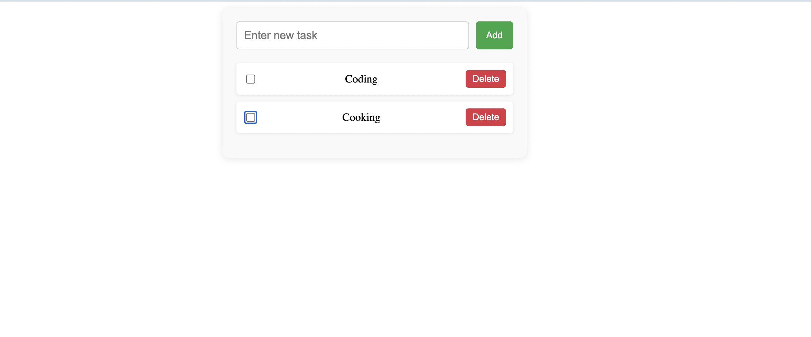

<h1 align="center"> Todo List App </h1>  

## Table of Contents

- [Introduction](#introduction)
- [Features](#features)
- [ScreenShorts](#screenshot)

<!-- END doctoc generated TOC please keep comment here to allow auto update -->

## Introduction

This is a to do list app wuth basic functionalities built using Angular 18

## Features

* Login functionality
* Signup funtionality
* Update todo list
* Remove to do list
* add todo List

## ScreenShorts

